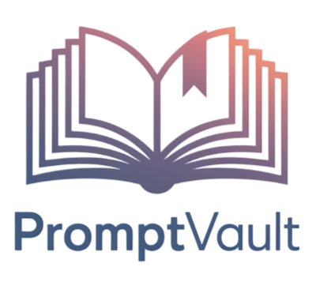

<h1 align="center">
  <a href="https://codeberg.org/medenor/promptvault">
    
  </a>
</h1>

<div align="center">
  PromptVault
  <br />
  <a href="#about"><strong>Explore the screenshots »</strong></a>
  <br />
  <br />
  <a href="https://codeberg.org/medenor/promptvault/issues">Report a Bug</a>
  ·
  <a href="https://codeberg.org/medenor/promptvault/issues">Request a Feature</a>
  ·
  <a href="https://codeberg.org/medenor/promptvault/issues">Ask a Question</a>
</div>

<div align="center">
<br />

[](LICENSE)

[](https://codeberg.org/medenor/promptvault/issues)
[](https://codeberg.org/medenor)

[](https://codeberg.org/medenor/promptvault/)

</div>

<details open="open">
<summary>Table of Contents</summary>

- [About](#about)
  - [Built With](#built-with)
- [Getting Started](#getting-started)
  - [Prerequisites](#prerequisites)
  - [Installation](#installation)
- [Usage](#usage)
- [Roadmap](#roadmap)
- [Support](#support)
- [Project assistance](#project-assistance)
- [Contributing](#contributing)
- [Authors & contributors](#authors--contributors)
- [Security](#security)
- [License](#license)
- [Acknowledgements](#acknowledgements)

</details>

---

## About

PromptVault is a prompt management application designed to help users easily organize, store, and retrieve their prompts for various AI applications, software development, content marketing, and much more. Whether you are a developer, writer, marketer, or simply a user of AI-based tools, PromptVault allows you to centralize your prompts and improve your productivity.

<details>
<summary>Screenshots</summary>
<br>

| Home Page | Prompt Editor | Categories Management |
| :---: | :---: | :---: |
|  |  |  |

</details>

### Built With

*   [Python](https://www.python.org/)
*   [PyQt6](https://riverbankcomputing.com/software/pyqt/)

## Getting Started

### Prerequisites

*   Python 3.6+

### Installation

1.  **Clone the repository**:
    ```bash
    git clone https://codeberg.org/medenor/promptvault.git
    cd PromptVault
    ```

2.  **Create a virtual environment** (recommended):
    ```bash
    python -m venv venv
    source venv/bin/activate  # On Windows, use `venv\Scripts\activate`
    ```

3.  **Install dependencies**:
    ```bash
    pip install -r requirements.txt
    ```

## Usage

To launch the application, run the `main.py` script:

```bash
python main.py
```

The application will open, allowing you to start managing your prompts.

## Roadmap

See the [open issues](https://codeberg.org/medenor/promptvault/issues) for a list of proposed features (and known issues).

## Support

Reach out to the maintainer at one of the following places:

- [Codeberg issues](https://codeberg.org/medenor/promptvault/issues)
- Contact options listed on [this Codeberg profile](https://codeberg.org/medenor)

## Project assistance

If you want to say **thank you** or/and support active development of PromptVault:

- Add a [Star](https://codeberg.org/medenor/promptvault) to the project.
- Write interesting articles about the project on your personal blog.

Together, we can make PromptVault **better**!

## Contributing

First off, thanks for taking the time to contribute! Contributions are what make the open-source community such an amazing place to learn, inspire, and create. Any contributions you make will benefit everybody else and are **greatly appreciated**.

Please read our contribution guidelines, and thank you for being involved!

## Authors & contributors

The original setup of this repository is by [Medenor](https://codeberg.org/medenor).

For a full list of all authors and contributors, see [the contributors page](https://codeberg.org/medenor/promptvault/graphs/contributors).

## Security

PromptVault follows good practices of security, but 100% security cannot be assured.
PromptVault is provided **"as is"** without any **warranty**. Use at your own risk.

## License

This project is licensed under the **MIT license**.

See [LICENSE](LICENSE) for more information.

## Acknowledgements

*   Repository files templates provided by [dec0dOS/amazing-github-template](https://github.com/dec0dOS/amazing-github-template)
